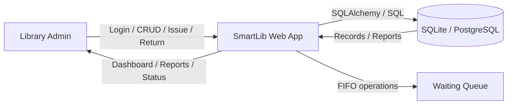

# DFD Level 0

```mermaid
flowchart LR
    U[Library Admin] -->|Login / CRUD / Issue / Return| S[SmartLib Web App]
    S -->|SQLAlchemy / SQL| DB[(SQLite / PostgreSQL)]
    S -->|FIFO operations| Q[Waiting Queue]
    DB -->|Records / Reports| S
    S -->|Dashboard / Reports / Status| U
```

Main flow:
User → Flask Route → Python Business Logic → DS / SQLAlchemy → Database → HTML Response
