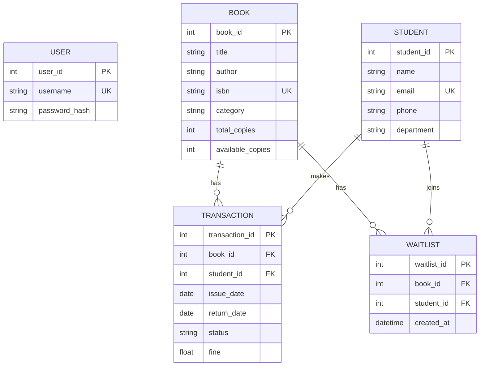

# ER Diagram

```mermaid
erDiagram
    USER { int user_id PK string username UK string password_hash }
    BOOK { int book_id PK string title string author string isbn UK string category int total_copies int available_copies }
    STUDENT { int student_id PK string name string email UK string phone string department }
    TRANSACTION { int transaction_id PK int book_id FK int student_id FK date issue_date date return_date string status float fine }
    WAITLIST { int waitlist_id PK int book_id FK int student_id FK datetime created_at }

    BOOK ||--o{ TRANSACTION : has
    STUDENT ||--o{ TRANSACTION : makes
    BOOK ||--o{ WAITLIST : has
    STUDENT ||--o{ WAITLIST : joins
```
